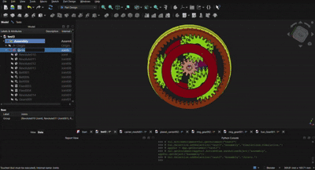

# ⚙️ Planetary Gear System — CAD Assembly & Simulation

A 3D CAD design and simulation of a **planetary gear system**, developed in **FreeCAD** to explore mechanical design, gear geometry, assembly, and motion.

The project contains the complete planetary gear assembly, individual components, CAD source files, engineering documentation, and a simulation of the mechanism in operation.

---

## 🎥 Simulation

### Planetary Gear Assembly in Motion

<p align="center">
  
</p>

The animation demonstrates the interaction between the **sun gear, planet gears, ring gear, and planet carrier** during operation.

For the full-quality simulation:
**[▶️ Open Full MP4 Simulation](../Simulation/Planet_gear_assembly.mp4)**

---

## 🔧 Project Overview

A planetary gear system is a compact mechanical transmission consisting of multiple gears working around a common central axis.

Unlike a conventional two-gear transmission, planetary gears distribute motion and load through multiple planet gears.

The main components of this design are:

* ☀️ **Sun Gear**
* 🪐 **Planet Gears**
* ⭕ **Ring Gear**
* 🛞 **Planet Carrier**

This configuration makes planetary gear systems particularly useful where **compact size, high torque transmission, and flexible speed ratios** are required.

---

## 🤖 Why Planetary Gears Matter in Robotics

Planetary gear mechanisms are especially useful in robotics because robotic actuators often need:

* High output torque
* Compact mechanical packaging
* Controlled rotational speed
* Good torque-to-weight ratio
* Coaxial input and output arrangements
* Precise transmission of motion

They can be found in systems such as:

* 🦾 Robotic arm joints
* ✋ Robotic hands and grippers
* 🤖 Robot actuators
* 🚗 Mobile robot drive systems
* 🛠️ Industrial robotic joints
* ⚙️ Servo and actuator gearboxes

A motor can operate at relatively high speed while producing comparatively lower torque. A gearbox allows that motion to be transformed into a slower, higher-torque output suitable for robotic joints and mechanisms.

---

## 🧩 Assembly Components

### ☀️ Sun Gear

The central gear of the planetary system.

It meshes with the surrounding planet gears and can act as the input, output, or fixed element depending on the transmission configuration.

### 🪐 Planet Gears

The smaller gears positioned around the sun gear.

Each planet gear rotates around its own axis while simultaneously revolving around the sun gear.

### ⭕ Ring Gear

The outer gear with internal teeth.

The ring gear meshes with the planet gears and forms the outer boundary of the planetary mechanism.

### 🛞 Planet Carrier

The carrier holds the planet gears at their required positions around the sun gear.

It can also serve as the output component depending on the selected transmission configuration.

---

# 📐 Mathematics Behind the Design

One of the fundamental geometric relationships in a conventional planetary gear system is:

```text
Nr = Ns + 2Np
```

Where:

* `Nr` = number of teeth on the ring gear
* `Ns` = number of teeth on the sun gear
* `Np` = number of teeth on each planet gear

This relationship ensures that the gears can maintain the required geometric arrangement and mesh correctly.

---

## ⚙️ Gear Ratio & Kinematics

The speed relationship of a planetary gear system can be expressed using the **Willis equation**:

```text
(ωs − ωc) / (ωr − ωc) = −Nr / Ns
```

Where:

* `ωs` = angular velocity of the sun gear
* `ωr` = angular velocity of the ring gear
* `ωc` = angular velocity of the carrier
* `Ns` = sun gear tooth count
* `Nr` = ring gear tooth count

By fixing different components and selecting different input/output components, the same planetary mechanism can produce different transmission ratios.

This is one of the reasons planetary gear systems are so useful in robotic actuators.

---

## 🛠️ CAD Design

The complete mechanism was modeled and assembled using **FreeCAD**.

### Included

* Complete planetary gear assembly
* Sun gear
* Planet gears
* Ring gear
* Planet carrier
* Individual editable CAD files
* Assembly model
* Motion simulation

---

## 📂 Project Structure

```text
Planetary-Gear-System/
│
├── Assembly/
│   └── planetary_gear_assembly.FCStd
│
├── Parts/
│   ├── Sun-Gear/
│   ├── Planet-Gears/
│   ├── Ring-Gear/
│   └── Carrier/
│
├── Images/
│   └── planetary_gear_simulation.gif
│
├── Simulation/
│   └── planetary_gear_simulation.mp4
│
├── Documentation/
│   └── CAD_Specifications.md
│
└── README.md
```

---

## 📊 CAD Specifications

Automatically generated CAD measurements and geometric information can be found in:

`Documentation/CAD_Specifications.md`

The documentation can include:

* Bounding dimensions
* Volume
* Surface area
* Position
* Number of solids
* Faces
* Edges
* Vertices
* FreeCAD object properties

---

## 🎯 Project Objectives

This project was developed to explore the relationship between:

**Mathematics → Mechanical Design → CAD → Simulation → Robotics**

The main objectives were:

* Design the individual gear components.
* Understand planetary gear geometry.
* Assemble the mechanism in FreeCAD.
* Study the mathematical relationships between the gears.
* Simulate the mechanical movement.
* Create reusable and documented CAD models.
* Explore how planetary transmission systems can be applied to robotics.

---

## 🔭 Future Improvements

Possible future improvements include:

* Detailed gear tooth specifications
* Module and pressure-angle calculations
* Complete gear-ratio analysis
* Torque and speed analysis
* Improved assembly constraints
* Higher-fidelity simulation
* STEP/STL exports
* 3D-printable versions
* Motor integration
* Integration with a robotic actuator
* ROS 2 / Gazebo simulation

---

## 🛠️ Software

| Tool                   | Purpose                         |
| ---------------------- | ------------------------------- |
| **FreeCAD**            | CAD modeling & assembly         |
| **FreeCAD Simulation** | Mechanical motion visualization |
| **Python**             | CAD documentation automation    |

---

## 👨‍💻 Author

**Vishal**

Engineering Student | Robotics & Electronics Enthusiast

---

## 📄 License

This project is distributed under the license specified in the root [`LICENSE`](../LICENSE) file.
